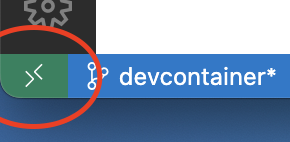

# Devcontainers & GitHub Codespaces

This repository has devcontainers available. They are a standard way to run development completely isolated. You find more information about them on https://containers.dev. Essentially, it runs your favorite IDE inside a Docker Container.
This documentation focuses on getting up and running and will not get into details about how devcontainers work.

Devcontainers can be run locally or in the cloud with GitHub Codespaces. Each have their advantages and drawbacks.  
**Codespaces** are generally instant to start and immediately ready to run. However you need a (somewhat) stable internet connection to work and they might cost something (for hobby use, the free usage will probably be enough: https://github.com/features/codespaces#pricing). To learn more about codespaces, see [here](https://docs.github.com/en/codespaces). GitHubs documentation is quite thorough.  
**Locally** running the devcontainers has the advantage that it's always free and doesn't need an internet connection to work but they need some time to pull all the docker images and ruby gems and to seed the database with initial test data.

## Local Setup

> [!NOTE]
> devcontainers can be used with many IDEs. This guide only presents VS Code, as it's Free. See https://containers.dev/supporting for more.

To get started with locally running the devcontainers, you need the following:
- [docker](https://docs.docker.com/get-docker/) and the [docker compose plugin](https://docs.docker.com/compose/install/)
- [Visual studio code](https://code.visualstudio.com)
- The [dev container extension](https://marketplace.visualstudio.com/items?itemName=ms-vscode-remote.remote-containers)

_You'll find more detailed requirements [here](https://code.visualstudio.com/docs/devcontainers/containers#_getting-started)._

1. To start testing, open this repository in VS Code and click on the green remote development button in the lower left corner of the window:  

2. In the menu that pops up, select "Reopen in Container"
3. Select the variant (wagon) you want to run.
4. Grab a coffee! The dev container will start which takes quite some time (depending on your computer this might take over 15min). It will clone the wagons, install all the ruby gems and migrate as well as seed the database.

## GitHub Codespaces Setup

In general, see here: https://docs.github.com/en/codespaces/developing-in-codespaces/creating-a-codespace-for-a-repository#creating-a-codespace-for-a-repository

Some notes for starting a hitobito codespace:

- Make sure to select "New with options" and then select the desired configuration. Otherwise it launches without any setup and won't be able to run.
- No need to change the branch, as it only changes the branch of the development environment, but not hitobito itself.

If you want to get familiar with codespaces, check the quickstart guide here: https://docs.github.com/en/codespaces/getting-started/quickstart

> [!WARNING]
> If you run codespaces in the browser, somehow the login is broken… try using it in vs code for now. It might have had to do with cors, but i couldn't figure out the actual issue.

## Starting hitobito

To actually run hitobito you can use regular ruby/rails commands in the Terminal:
```sh
rails server -b 0.0.0.0
```

The shell is already in the context of the ruby bundler.

### Starting in VS Code

For VS Code or Github Codespaces Users, you can even use the IDE features like setting breakpoints etc.

To do so, there is a `.vscode/launch.json` file mounted. This allows you to go to the "Run and Debug" tab in the main navigation, select a Task from the dropdown and click the play button. It will launch hitobito or the specs in a separate panel and attach the debugger.

## Rebuilding

If you change something with the docker setup and/or change the Gemfile, simply rebuild the codespace. In VS Code this can easily be achieved by pressing <kbd>Shift</kbd>+<kbd>Command</kbd>+<kbd>P</kbd> (Mac) or <kbd>Ctrl</kbd>+<kbd>Shift</kbd>+<kbd>P</kbd> and then Entering `Rebuild Container`.

To also freshly seed your database, type `Full Rebuild Container`.

With both rebuilds, your changes are kept. To get a totally clean setup, delete your codespace and create a new one.

If rebuild fails, you probably should update your hitobito repos first…

## A note about committing and pushing

When running the devcontainer locally, you should be able to commit and push as normal even from inside the container (vs code passes through authentication). Please keep in mind though, that the devcontainer clones the core and wagons via http and from the main repositories, so you probably first need to add your fork as a git remote (`git remote add <remote-name> <url>`)

When running in codespaces, it becomes a bit more tricky. I did not yet fully investigate this scenario, you might find some hints [here](https://docs.github.com/en/codespaces/managing-your-codespaces/managing-repository-access-for-your-codespaces) or [here](https://docs.github.com/en/codespaces/prebuilding-your-codespaces/allowing-a-prebuild-to-access-other-repositories). Please open a PR if you have this working and extend this documentation!

## More

If you want to dive deeper: [check here](DevcontainerInDepth.md)